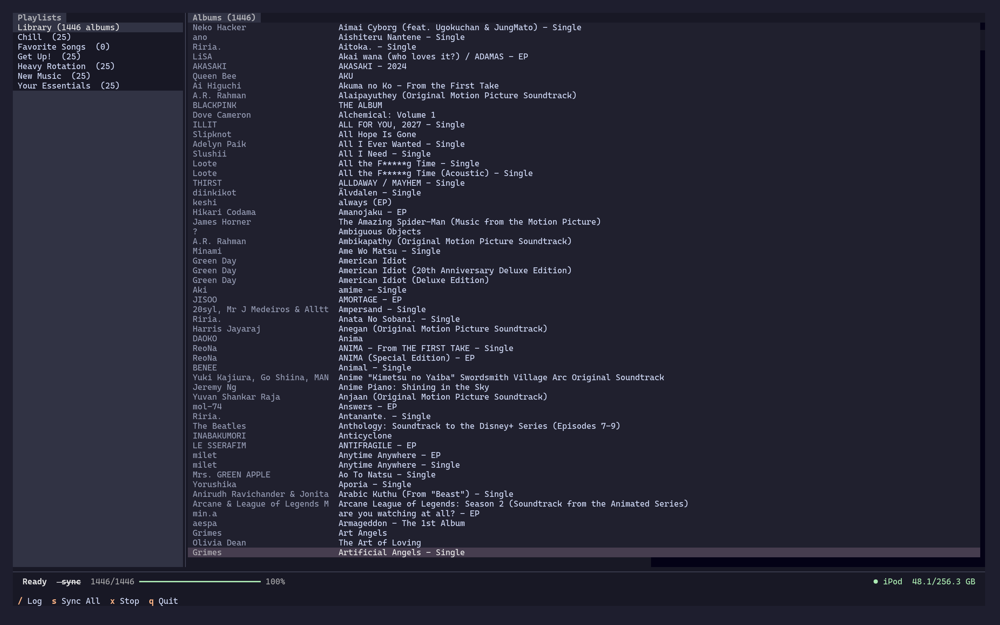
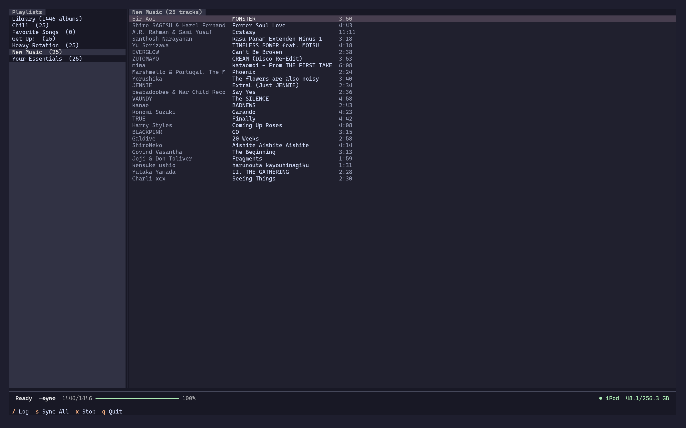

# podsync

A terminal UI for syncing your Apple Music library to an iPod Classic, Nano, or Mini on Linux.

Downloads all albums and playlists from your Apple Music account and copies them to a connected iPod, recreating your playlists on the device.

## Screenshots




## System dependencies

Install these with pacman before running:

```
sudo pacman -S libgpod ffmpeg
```

You also need `mp4decrypt` from the Widevine toolchain. Install it via AUR:

```
yay -S widevine-aur
```

Or place the `mp4decrypt` binary somewhere in your PATH manually.

## Python dependencies

Requires Python 3.13 and [uv](https://github.com/astral-sh/uv).

```
uv sync
```

This installs all Python dependencies including `gamdl`, `textual`, `mutagen`, and `cffi`. The libgpod C extension is compiled automatically on first run.

## Setup

Export your Apple Music cookies from a browser session on music.apple.com using a browser extension that exports in Netscape format. Save the file as `cookies.txt` in the project directory.

## Running

```
uv run python ipod_sync.py
```

Options:

```
--cookies PATH    Path to cookies.txt (default: ./cookies.txt)
--overwrite       Re-download albums that already exist locally
```

## Usage

The app loads your full library on startup. Navigation:

| Key | Action |
|-----|--------|
| Tab | Switch between playlists and track panes |
| j / k | Move cursor down / up |
| Enter | Focus track pane |
| Escape / Backspace | Return to playlist pane |
| g g | Jump to top |
| G | Jump to bottom |
| Ctrl+f / Ctrl+b | Page down / up |
| s | Start sync |
| x | Stop sync |
| / | Open log viewer |
| q | Quit |

Before pressing `s` to sync, make sure your iPod is mounted. Open your file manager (Nautilus, Thunar, etc.), find the iPod in the sidebar, and click it to mount it. The bottom right of the app will show the device name and storage once it is detected.

Press `s` to start a sync. The app first downloads any missing albums from Apple Music, then copies new tracks to the iPod and syncs playlists.

The iPod connection status and storage usage are shown in the bottom right of the screen.

## Notes

Downloaded music is stored in the path configured in `~/.gamdl/config.ini` under `output_path`. Defaults to `./Apple Music`.

A download cache is kept at `~/.apple-music-manager/cache.json` to skip already-completed albums on subsequent runs.
